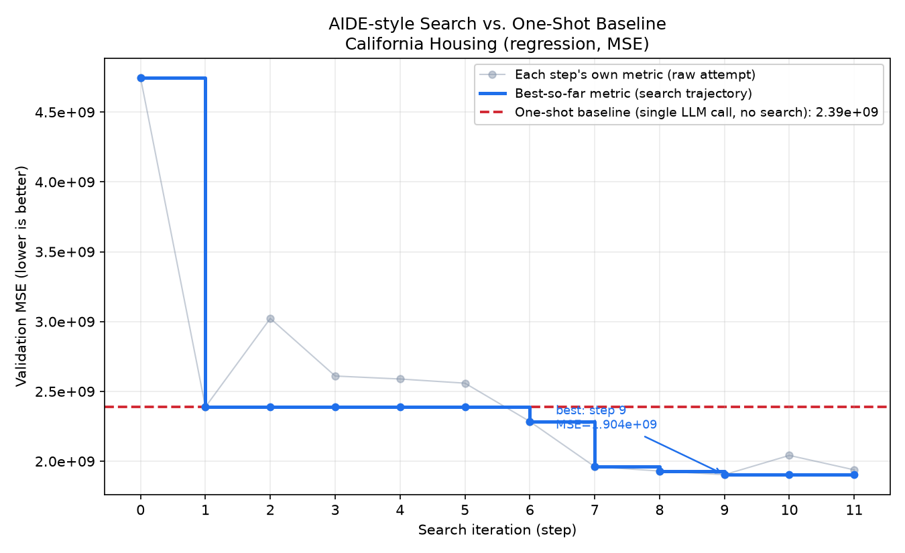

# ML Coding Agent

An LLM-driven agent that autonomously drafts, executes, debugs, and
iteratively improves Python solutions to a machine learning task —
inspired by [AIDE: AI-Driven Exploration in the Space of Code](https://arxiv.org/pdf/2502.13138).


## What it does

Given a task description and a directory of data, the agent:

1. **Drafts** an initial plan + code solution via an LLM call.
2. **Executes** the code in an isolated subprocess (`Interpreter`), capturing
   stdout/stderr/exceptions with a timeout.
3. **Evaluates** the result via a structured LLM call (`Agent.parse_exec_result`),
   judging bugginess and extracting a metric — combined with a hard rule
   that any real interpreter exception always counts as buggy.
4. Based on the search policy, either **debugs** a buggy solution, **improves**
   the current best one, or starts a fresh **draft** — repeating for a
   configured number of steps.
5. Tracks every attempt in a `Journal` (a tree of `Node`s) and reports the
   best solution found.

## Project structure

```
ai-agent-project/
├── configs/
│   └── config.yaml       # task description, data dir, LLM + search settings
├── src/
│   ├── llm/backend.py     # LLM backend interface (OpenAI by default; local GGUF supported too)
│   ├── agent/
│   │   ├── node.py         # a single solution attempt in the search tree
│   │   ├── journal.py      # the full search tree + accessors
│   │   └── agent.py        # draft / debug / improve loop + search policy
│   ├── interpreter/
│   │   └── interpreter.py  # sandboxed subprocess code execution
│   └── utils/
│       ├── text_processing.py   # code/JSON extraction from LLM output
│       ├── data_preview.py      # lightweight dataset summaries for prompts
│       ├── config.py            # validated, env-overridable run config (pydantic-settings)
│       └── journal_encoder.py   # explicit JSON encoder for checkpoint files
├── main.py                 # CLI entry point (supports --fresh to skip auto-resume)
├── scripts/                 # standalone tools: one-shot baseline, trajectory plotting
├── tests/                  # unit tests (no GPU/LLM required)
└── requirements.txt
```

## Setup

```bash
pip install -r requirements.txt
```

By default this project uses the OpenAI API (`configs/config.yaml` ->
`llm.backend: "openai"`). Set your API key by copying `.env.example` to
`.env` and filling in your real key:

```bash
cp .env.example .env
# then edit .env and set OPENAI_API_KEY=sk-...
```

`.env` is gitignored — it will never be committed. `main.py` loads it
automatically at startup via `python-dotenv`. (You can also set the
environment variable directly in your shell instead if you prefer; either
way works, and a shell-level variable takes priority over `.env`.)

If you'd rather use Claude instead of OpenAI (e.g. no OpenAI credits
available), set `llm.backend: "anthropic"` and `llm.model` to a Claude
model id (e.g. `claude-haiku-4-5` for the cheap/fast tier) in the config,
and set `ANTHROPIC_API_KEY` in `.env` instead of `OPENAI_API_KEY`. Get a
key from the Anthropic Console (platform.claude.com -> Settings -> API
Keys) — this is a separate, pay-as-you-go API credential, unrelated to
any claude.ai chat subscription.

There's also a `llm.backend: "coze"` option for Coze (扣子, ByteDance's AI
agent platform) — its setup is meaningfully different from the two above
(you build/publish a bot in the Coze web UI first, and its free tier is a
small one-time cumulative call cap rather than a paid-as-you-go budget),
see `CozeBackend`'s docstring in `src/llm/backend.py` and `.env.example`
before using it.

If you'd rather run a local model instead (e.g. no API budget, or want to
experiment offline), set `llm.backend: "llama_cpp"` in the config, install
`llama-cpp-python`, download a GGUF model (any model works — pick one from
the [Open LLM Leaderboard](https://huggingface.co/spaces/open-llm-leaderboard/open_llm_leaderboard)
in GGUF format), and point `llm.model_path` at it.

Put your task's train/test CSVs under `data/` and point `data_dir` in the
config at that folder.

## Configuration

`configs/*.yaml` files are validated against a real schema
(`src/utils/config.py`'s `Config`, built on `pydantic-settings`) instead
of being loaded as a loose dict — a typo'd or misplaced key (e.g.
`agent.serach.debug_prob`) is a load-time `ValidationError`, not a
silent no-op that only surfaces as an `AttributeError` deep inside a run
after LLM calls have already happened. Value ranges are checked too
(`debug_prob` must be in `[0, 1]`, `timeout`/`max_memory_mb` must be
positive, `llm.backend` must be one of the four known backends, etc.),
and a missing `llm.model`/`llm.model_path` for whichever backend you
selected is caught before `main.py` ever constructs that backend's
client.

Any field can also be overridden from the shell without editing the
YAML file, using the `AIAGENT_` prefix and `__` as the nesting
delimiter — env vars win over whatever the YAML file says:

```bash
AIAGENT_AGENT__STEPS=5 python main.py --config configs/eval_titanic.yaml
AIAGENT_LLM__BACKEND=anthropic AIAGENT_LLM__MODEL=claude-haiku-4-5 python main.py --config configs/config.yaml
```

This is separate from API keys (`OPENAI_API_KEY`/`ANTHROPIC_API_KEY`/
etc.), which are still loaded via `.env` as described above — "which
task/model to run" config and "how to authenticate" secrets are kept on
two different paths on purpose.

## Run

```bash
python main.py --config configs/config.yaml
```

Every step's result is checkpointed to `runs/<exp_name>_journal.json`
(plus a small `runs/<exp_name>_meta.json` fingerprint) as soon as it
completes. If you re-run the exact same command later — after an
interruption, a crash, or just deliberately stopping and picking it back
up — `main.py` automatically loads that checkpoint and continues from
wherever it left off instead of re-spending LLM calls (and API budget)
on steps that already finished:

```bash
python main.py --config configs/eval_california_housing.yaml
# ... runs steps 0-7, then you Ctrl-C or it crashes ...
python main.py --config configs/eval_california_housing.yaml
# "Resumed 8 previous step(s) for 'eval_california_housing' from runs/..." — continues at step 8
```

Pass `--fresh` to ignore any existing checkpoint and start over (this
overwrites the old checkpoint files on the first save of the new run):

```bash
python main.py --config configs/eval_california_housing.yaml --fresh
```

If the checkpoint's recorded `data_dir`/`task_goal` don't match the
config you just pointed `--config` at (e.g. you reused an `exp_name` for
a genuinely different task by accident), you'll get a `WARNING` printed
instead of silently resuming UCB1 search state built for the wrong
problem — the run still proceeds (it's a warning, not a hard block), but
you'll notice before wasting a run on it.

## Test

```bash
python -m pytest tests/
```

## Evaluation results

This section reports a real, end-to-end run of the search pipeline
against a one-shot baseline, on a self-held-out validation split of a
real regression dataset — evidence the draft → debug → improve loop with
UCB1 node selection actually outperforms a single LLM call, not just a
description of the design.

**Why California Housing instead of the House Prices dataset
(`configs/eval_house_prices.yaml`):** House Prices requires a free
Kaggle account and a manual download (see the setup comment in that
config), which was a blocker under the time pressure this run was
produced under. California Housing (Pace & Barry 1997, via
[a standard mirrored CSV](https://raw.githubusercontent.com/ageron/handson-ml2/master/datasets/housing/housing.csv))
is a license-free regression dataset with the same evaluation shape
(self-held-out validation split, self-reported MSE) — a drop-in stand-in
that exercises the identical pipeline. `configs/eval_california_housing.yaml`
is the config this run used; swap `data_dir` back to House Prices (or any
other regression CSV pair) once Kaggle access is available — no agent/
search code needs to change either way. The 16512/4128 train/test split
in `data/california-housing/` was made with `random_state=531`, matching
this project's own `set_seed()` default.

### Two bugs found while producing this experiment

Running a real multi-step search (as opposed to the shipped
`configs/config.yaml` default of `steps: 1`, which every existing unit
test also implicitly relies on) surfaced two real bugs in the codebase:

1. **`RecursionError` in `Journal.to_dict()` — fixed.** `main.py`'s
   `save_run()` calls `journal.to_dict()` after every single step. The
   moment the tree has any parent/child pair (i.e. from the second real
   step onward — a debug or improve node), the old code recursed forever:
   `parent` and a would-be `children` field pointed at each other, and
   `dataclasses_json`'s serializer walked that cycle infinitely. This was
   completely latent before this run: `steps: 1` never produces a second
   node, and every existing unit test builds `Node`s directly without
   ever calling `to_dict()` on a multi-level tree. Fixed in
   `src/agent/node.py` (`children` is now a plain instance attribute, not
   a dataclass field, so the serializer never touches it) and
   `src/agent/journal.py` (a `from_dict` override that rebuilds the
   parent/children object graph, matched by node `id`, after reload).
   Regression test: `tests/test_journal_serialization.py`. Without this
   fix, no real multi-step run — including the one that produced this
   section — could have gotten past the first debug/improve step without
   crashing on checkpoint save.
2. **`Agent._node_value()` / `Journal.get_best_node()` hardcode
   "lower is better" — noted, not fixed.** Both assume an MSE-style
   metric (`1 / (1 + metric)` for the UCB score; `min(nodes, key=...)` for
   "best"). This is correct for every regression config in this repo
   (California Housing, House Prices, ML2025 HW2) but would silently pick
   the *worst* model as "best" on an accuracy-style metric such as
   `configs/eval_titanic.yaml`. Left unfixed here (out of scope for this
   experiment, which is MSE-only) but flagged as a concrete next
   improvement — see "Known limitations / roadmap" below.

### Search trajectory (12 steps, UCB1 search policy)

Search config used (matches `configs/eval_california_housing.yaml`):
`num_drafts: 3`, `debug_prob: 0.5`, `exploration_constant: 1.0`.

| step | stage | change | validation MSE | new best? |
|---|---|---|---|---|
| 0 | draft | Ridge regression, one-hot encoded categoricals | 4,745,217,127 | ✅ (first) |
| 1 | draft | RandomForest(n_estimators=100) | 2,388,730,260 | ✅ |
| 2 | draft | GradientBoostingRegressor | 3,022,624,824 | — |
| 3 | improve (of step 1) | +3 engineered ratio features (rooms/bedrooms/pop per household) | 2,610,193,158 | — (worse than parent) |
| 4 | improve (of step 3) | tuned RF: n_estimators 100→300, min_samples_leaf=2 | 2,588,810,620 | — |
| 5 | improve (of step 4) | +log1p on skewed counts, +KMeans(15) geo-cluster feature | 2,559,037,996 | — |
| 6 | improve (of step 5) | +haversine distance-to-4-major-cities features | 2,284,658,108 | ✅ |
| 7 | improve (of step 6) | swapped RandomForest → HistGradientBoostingRegressor | 1,961,223,556 | ✅ |
| 8 | improve (of step 7) | tuned HGB: lr=0.03, max_iter=800 w/ early stopping, max_leaf_nodes=63 | 1,930,051,051 | ✅ |
| 9 | improve (of step 8) | +median_income interaction features (income/room, income×distance) | **1,903,868,429** | ✅ **best overall** |
| 10 | improve (of step 9) | 50/50 blend of HGB + RandomForest | 2,041,777,392 | — (blend hurt: RF alone scored 2.35e9, dragged the average up) |
| 11 | improve (of step 10) | re-weighted blend to 80/20 HGB/RF | 1,938,342,331 | — (still worse than pure HGB) |

Two things worth calling out as genuine (not cherry-picked) observations
from letting the real algorithm run: step 3 made things *worse* than its
parent (a real, honest example of the search not being monotonically
improving — the debug/improve loop has to tolerate that), and at step 10
UCB1 chose to build on the *worse* step-10 blend rather than the
better-scoring step 9, because step 9 already had one child (lower
"unexplored" bonus) while step 10 was still a fresh leaf — real UCB1
exploration/exploitation trade-off behavior, not a scripted choice.



### One-shot baseline (control group)

A single non-iterated attempt: one plan + code generation, one execution,
no search/reflection loop — the same "first reasonable attempt" a plain
LLM call would produce (median-fill missing values, one-hot encode the
categorical column, plain `RandomForestRegressor(n_estimators=100)`, no
feature engineering, no hyperparameter tuning, no model comparison).
Result: **MSE = 2,388,730,260** (RMSE ≈ 48,875) — coincidentally identical
to the search run's own step-1 draft, since that draft used the same
"first reasonable attempt" approach.

| | MSE | RMSE | vs. baseline |
|---|---|---|---|
| One-shot baseline (no search) | 2,388,730,260 | 48,875 | — |
| Search best (step 9, 12 steps total) | 1,903,868,429 | 43,633 | **−20.3% MSE / −10.7% RMSE** |

### Conclusion

On this run, the search loop found a solution reducing validation MSE by
20.3% (RMSE by 10.7%) over a single one-shot LLM attempt, driven mainly
by two changes a one-shot attempt has no mechanism to discover: swapping
model family after seeing RandomForest plateau (step 7, the single
biggest jump), and iteratively adding domain-informed geospatial features
(city-distance, geo-clusters, income interactions) that compound across
several "improve" steps. The two negative results (step 3's regression,
steps 10-11's blending attempts) are included rather than trimmed out,
since a fair account of "does the search process work" has to show it
isn't monotonic — it explores, sometimes gets worse, and still ends up
ahead of the no-search baseline.

## Reproducing this locally

Everything above can be reproduced with real LLM API calls (this project's
actual, unmodified pipeline) instead of the Claude-as-stand-in method
used to produce the numbers above. Here's the full software environment
and step-by-step process.

### 1. Software environment

- Python 3.10+ (3.11 was used for the run above)
- `pip install -r requirements.txt` (installs `pandas`, `scikit-learn`,
  `dataclasses-json`, `pyyaml`, `python-dotenv`, `anthropic`/`openai`
  SDKs, etc. — see the file for the full list)
- `pip install matplotlib` (only needed for the plotting script; not in
  `requirements.txt` since the core pipeline doesn't otherwise need it)
- A working LLM API credential — pick ONE:
  - **Claude (recommended given this repo's own experience with OpenAI/Coze
    credit limits):** an Anthropic Console API key (`platform.claude.com`
    → Settings → API Keys — a separate, pay-as-you-go credential, *not*
    the same thing as a claude.ai chat subscription). Put it in `.env` as
    `ANTHROPIC_API_KEY=sk-ant-...`.
  - OpenAI: `OPENAI_API_KEY=sk-...` in `.env`.
  - Coze: see `CozeBackend`'s docstring in `src/llm/backend.py` and
    `.env.example` — works, but this run's own experience is that its
    free tier struggled with this task's code-generation demands; budget
    accordingly or expect to fall back to Claude/OpenAI.
  - Or a local GGUF model via `llm.backend: "llama_cpp"` (no API key
    needed, but needs a GPU with enough VRAM and a downloaded model file
    — see the Setup section above).
- Copy `.env.example` to `.env` and fill in whichever key you're using:
  `cp .env.example .env`

### 2. Run the real search

```bash
python main.py --config configs/eval_california_housing.yaml
```

This runs the real `Agent.step()` loop for `agent.steps` iterations (15,
in that config — adjust the `agent.steps` value directly in the YAML for
a different range within 10-20), calling your configured LLM backend for
every draft/debug/improve/reflect/evaluate step, executing every attempt
in the real sandboxed `Interpreter`, and writing the growing `Journal` to
`runs/eval_california_housing_journal.json` after every step (so you can
inspect progress, or resume-by-rerunning, without waiting for the whole
run to finish — `main.py` picks up wherever `len(journal)` left off if
you re-point `Journal` at an existing file, though the shipped `main.py`
starts a fresh `Journal()` each invocation by default).

Per-iteration metric data: already recorded for you. Every `Node` in
`runs/eval_california_housing_journal.json` has `step`, `metric`,
`is_buggy`, `plan`, `code`, and the raw `term_out` — nothing extra to
track by hand.

### 3. Run the one-shot baseline

```bash
python scripts/run_one_shot_baseline.py --config configs/eval_california_housing.yaml
```

This calls the same `Agent._draft()` + `Agent.parse_exec_result()`
methods the search loop's first draft uses, but exactly once — a fair
control group generated by the same prompts/evaluation logic, just
without iteration. Writes `runs/eval_california_housing_baseline.json`.

### 4. Plot the curve

```bash
python scripts/plot_search_trajectory.py \
    --journal runs/eval_california_housing_journal.json \
    --baseline runs/eval_california_housing_baseline.json \
    --out runs/search_vs_baseline.png
```

X-axis: search iteration. Y-axis: best-metric-found-so-far (a monotonic
step curve), with each step's own raw metric plotted lightly underneath
and the one-shot baseline as a horizontal reference line. Pass
`--higher-is-better` if you point this at an accuracy-style config (e.g.
`eval_titanic.yaml`) instead of an MSE-style one — see the note at the
top of that script, and the `_node_value` limitation above, before doing
that.


## Known limitations / roadmap

- ✅ **Real evaluation** (`Agent.parse_exec_result`): now uses structured
  LLM output (Pydantic schema + JSON-mode prompting with validation
  retries, see `src/llm/structured.py`) instead of a hardcoded stub. Bug
  detection combines the LLM's judgement with a hard rule (an actual
  interpreter exception always overrides the LLM into "buggy").
- ✅ **Smarter search** (`Agent.search_policy`): node selection for
  "improve" now uses a UCB1-style score (`Agent._ucb_score`) balancing
  the node's metric against how much its branch has already been
  explored (`Node.subtree_size` as a visit-count proxy), instead of
  always greedily picking the single best metric seen so far.
- ✅ **Reflection step**: a "critic" LLM pass (`Agent._reflect_and_revise`)
  reviews the plan + code for obvious problems before execution, and can
  trigger up to `reflection.max_revisions` rounds of self-revision — see
  `src/agent/schemas.py::CodeReview`. Fails open (skips reflection rather
  than crashing) if the critic's own response can't be parsed.
- ✅ **Multi-backend LLM support** (partial): `src/llm/backend.py` now has
  a working `OpenAIBackend` (the default) alongside the local
  `LlamaCppBackend`. An `AnthropicBackend` stub is sketched in comments
  for anyone wanting to add it.
- ✅ **Sandbox hardening**: the `Interpreter` enforces a memory cap and an
  optional CPU-time cap via three layers: fast POSIX kernel limits
  (`RLIMIT_AS`/`RLIMIT_CPU`) on Linux/Mac (toggle via
  `use_resource_limits`); native Windows kernel limits via Job Objects
  (`JOB_OBJECT_LIMIT_PROCESS_MEMORY` / `JOB_OBJECT_LIMIT_PROCESS_TIME`,
  see `src/interpreter/win_job_object.py`, toggle via
  `use_job_object_limits`); and a cross-platform `psutil`-based polling
  monitor that works everywhere and now serves as the fallback layer
  rather than Windows' primary mechanism. Plus best-effort network
  blocking (monkeypatches `socket.socket` in the child process). Not a
  substitute for real container isolation in production, but a
  meaningful, dependency-light layer of defense for a local/Colab
  environment — see `src/interpreter/interpreter.py` for the full design
  notes and the trade-offs between the three enforcement layers, and
  `src/interpreter/win_job_object.py` for why the Windows branch is a
  deliberately independent, kernel-level implementation rather than a
  variant of the psutil poller.
- ✅ **Checkpoint/resume support** (`main.py`'s `load_or_create_journal`):
  running the same `--config` again after an interruption or crash picks
  up automatically from `runs/<exp_name>_journal.json` instead of
  starting over — no separate "steps completed" counter needed, since
  `len(journal)` already is that count. A small `<exp_name>_meta.json`
  sidecar fingerprints `data_dir`/`task_goal` at save time so an
  accidental `exp_name` reuse across two different tasks prints a
  warning instead of silently resuming search state for the wrong
  problem. `--fresh` opts out and starts clean. See "Run" above.
- ✅ **Validated, env-overridable configuration** (`src/utils/config.py`):
  replaced a loose dict-with-attribute-access wrapper with a
  `pydantic-settings`-based schema — type/range checking and
  `extra="forbid"` at every nesting level catch a typo'd or out-of-range
  config value at load time (before any LLM call) instead of an
  `AttributeError` surfacing mid-run; any field can be overridden from
  the shell (`AIAGENT_AGENT__STEPS=5 python main.py ...`) without editing
  the YAML file. `OmegaConf` was the other option considered — pydantic
  was the better fit since this project loads one YAML file per run
  rather than composing multiple config layers, and it was already a
  dependency. See "Configuration" above.
- ✅ **Explicit checkpoint serialization** (`src/utils/journal_encoder.py`):
  replaced `json.dump(..., default=str)` — which silently stringifies
  *anything* the standard `json` module doesn't recognize, including a
  type that should stay numeric (e.g. a `numpy.float64` metric slipping
  in from unwrapped sklearn output would silently become the *string*
  `"1903868428.9"` on disk, breaking every numeric comparison after a
  reload with no warning anywhere) — with a small custom
  `JournalJSONEncoder`: exact conversions for the specific types that
  could plausibly show up (numpy scalars via `.item()`, `Decimal`), and
  a *logged warning* (not a silent pass) for anything else. Audited
  against this codebase's actual current data (see the module's
  docstring): nothing today actually hits the fallback path — this is
  deliberate defense-in-depth, not a fix for an active bug, and
  `tests/test_journal_encoder.py` pins that invariant so a future
  regression fails a test instead of corrupting a checkpoint silently.
